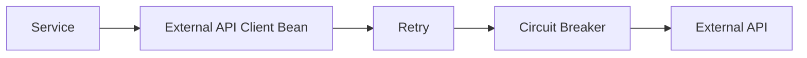
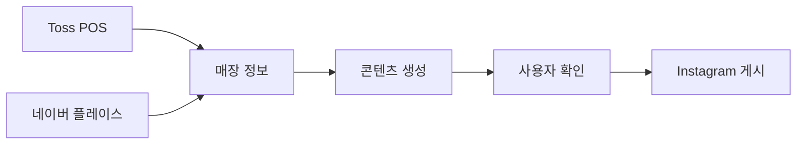

# 📣 맡케팅

소상공인이 매장 정보를 확인하고 홍보 콘텐츠를 만든 뒤 Instagram에 게시하는 여러 단계를 하나의 흐름으로 연결한 SNS 마케팅 자동화 서비스입니다.

> 이 저장소는 프로젝트 경험과 기여를 정리한 소개 저장소이며 소스 코드는 포함하지 않습니다.

## 프로젝트 정보

- **기간**: 2026.05 ~ 2026.06
- **형태**: Team Project
- **역할**: Backend Developer

## 문제와 목표

소상공인의 SNS 홍보 업무는 매장과 상품 정보를 다시 찾고, 콘텐츠를 제작하고, 채널을 이동해 게시하는 반복 작업으로 구성됩니다. 여러 외부 서비스의 데이터를 연결해 반복 입력을 줄이고, 일부 API에 장애가 발생해도 전체 게시 흐름이 함께 중단되지 않는 구조를 목표로 했습니다.

## 주요 기능

- 매장·상품 정보 불러오기
- 네이버 플레이스 기반 매장 정보 보완
- 홍보 콘텐츠 생성
- Meta 계정 연결과 Instagram 게시
- 음성 콘텐츠 생성 결과 캐시

## 담당 업무

- Toss POS 데이터 연동
- 네이버 플레이스 정보 수집
- Meta OAuth와 Instagram Graph API 연동
- 외부 API 호출에 Retry·Circuit Breaker 적용
- Clova TTS 결과 캐시
- 콘텐츠 생성부터 게시까지의 백엔드 흐름 구현

## 문제 해결 — Circuit Breaker가 작동하지 않던 원인

외부 API 장애에 대비해 Retry와 Circuit Breaker를 적용했지만, 동일 클래스 내부에서 보호 대상 메서드를 호출할 때는 기대한 로직이 실행되지 않았습니다.

원인은 Spring AOP가 프록시를 거치는 외부 호출에 부가기능을 적용하는 구조인데, 자기 호출은 프록시를 통과하지 않는 데 있었습니다. 외부 API 호출 책임을 별도 Bean으로 분리하고 해당 Bean을 통해 호출하도록 변경해 Retry와 Circuit Breaker가 정상적으로 적용되도록 개선했습니다.

## 서비스 흐름

## Tech Stack

- **Backend**: Java, Spring Boot
- **Database**: PostgreSQL
- **Auth & Integration**: OAuth2, Meta OAuth, Instagram Graph API
- **Resilience**: Resilience4j Retry, Circuit Breaker
- **External Data**: Toss POS, 네이버 플레이스, Clova TTS
- **Deployment**: Docker

## 배운 점

- 외부 API 연동에서는 정상 응답뿐 아니라 지연·실패·호출 제한을 서비스 흐름의 일부로 설계해야 한다는 점
- 선언적으로 적용한 기능도 실제 프록시와 호출 경로를 확인해야 한다는 점
- 자동화의 가치는 기술의 수보다 사용자가 반복하던 단계를 얼마나 줄였는지에 있다는 점

