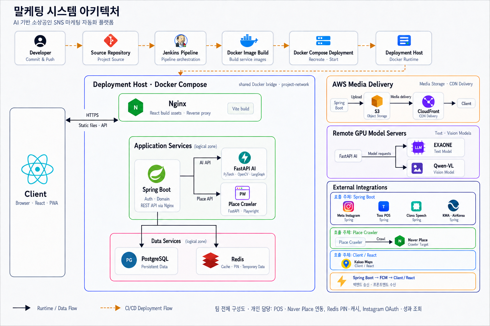

# 맡케팅

> 이제 맡겨주세요, 마케팅

SNS 마케팅이 낯선 **50·60대 소상공인을 위한 AI 기반 인스타그램 콘텐츠 제작·게시 서비스**입니다. 매장 정보를 반복해서 입력하고 콘텐츠를 직접 제작해야 하는 부담을 줄이기 위해, 정보 수집부터 콘텐츠 생성·확인·게시·성과 조회까지 연결했습니다.

| 구분 | 내용 |
|---|---|
| 개발 기간 | 2026.04.06 ~ 2026.05.21 · 7주 |
| 개발 인원 | 6명 |
| 담당 역할 | Backend — 외부 데이터 연동, 계정 연결·인증, 외부 API 장애 대응 |
| 프로젝트 상태 | SSAFY 팀 프로젝트 V1 완료 |

> 팀 프로젝트의 구현 내용과 개인 기여를 정리한 문서용 저장소입니다. 소스 코드는 포함하지 않습니다.

[주요 기능](#주요-기능) · [시스템 아키텍처](#시스템-아키텍처) · [개인 기여](#개인-기여) · [트러블슈팅](#트러블슈팅) · [기술 스택](#기술-스택)

## 주요 기능

- **매장 연결:** Toss POS를 연결해 메뉴·가격을 조회하고 Naver Place의 상세정보를 결합합니다.
- **콘텐츠 제작·게시:** 매장 정보와 사용자 입력을 바탕으로 AI가 이미지·캡션을 생성하고, 사용자가 확인한 콘텐츠를 Instagram에 게시합니다.
- **성과 확인:** Instagram의 `views`, `saves`, `shares` 지표를 조회합니다.

## 시스템 아키텍처

아래는 **팀 전체 시스템의 구성도**입니다. 개인 담당 범위는 [개인 기여](#개인-기여)와 [트러블슈팅](#트러블슈팅)에 정리했습니다.

[아키텍처 이미지 크게 보기](docs/images/architecture.png)

| 구성 | 역할과 연결 |
|---|---|
| 웹 요청 | 브라우저에서 실행되는 React 클라이언트가 Nginx를 통해 Spring Boot API를 호출합니다. Nginx는 프론트엔드 정적 파일도 제공합니다. |
| AI·정보 수집 | Spring Boot가 FastAPI AI 서비스와 Place Crawler를 호출합니다. AI 서비스는 외부 GPU 모델 서버를, 크롤러는 Naver Place를 이용합니다. |
| 데이터·미디어 | PostgreSQL에 서비스 데이터를 저장하고, Redis를 PIN·상세정보 캐시에 사용합니다. 미디어는 S3에 저장하고 CloudFront를 통해 제공합니다. |
| 배포 | Jenkins에서 서비스 이미지를 빌드하고 Docker Compose로 배포합니다. 애플리케이션과 데이터 영역은 하나의 Docker 네트워크 안에서 역할에 따라 구분한 영역입니다. |

## 개인 기여

매장 정보 입력과 계정 연결을 간소화하는 백엔드 연동을 담당했습니다.

| 담당 영역 | 구현 내용 |
|---|---|
| POS·Naver Place 데이터 병합 | Toss Catalog API와 Playwright 기반 크롤러를 연동했습니다. 표기가 다른 메뉴명을 정규화해 POS 메뉴·가격에 Naver Place 설명을 결합하고, 상세정보에 **Redis 캐시·TTL 30분**을 적용했습니다. |
| Toss POS 계정 연결 | Merchant ID에 대응하는 일회용 PIN을 Redis에 저장하고 **TTL 180초**를 설정했습니다. 사용자가 Merchant ID 대신 PIN을 입력해 매장과 서비스 계정을 연결하도록 구현했습니다. |
| Instagram 인증·성과 조회 | Meta OAuth와 장기 액세스 토큰 관리 흐름을 구현했습니다. Instagram User Insights의 `views`, `saves`, `shares`를 조회해 내부 데이터로 변환했습니다. |

## 트러블슈팅

### 1. 자기 호출로 Retry·Circuit Breaker가 적용되지 않는 문제

**AS-IS — 장애 대응 설정이 실제 호출에 적용되지 않음**

외부 API의 지연·실패에 대비해 Resilience4j Retry·Circuit Breaker를 설정했지만, 동일 클래스 내부에서 보호 대상 메서드를 호출할 때는 기대한 로직이 실행되지 않았습니다.

**원인 — Spring AOP 프록시를 우회하는 자기 호출**

프록시 기반 Spring AOP는 프록시를 통과하는 호출에 부가기능을 적용합니다. 동일 객체 내부의 메서드 호출은 프록시를 거치지 않아, 선언한 장애 대응 로직이 적용되지 않았습니다.

**TO-BE — 외부 API 호출 책임을 별도 Bean으로 분리**

외부 API 호출을 별도 Bean으로 옮기고 서비스가 주입받은 Bean을 통해 호출하도록 변경했습니다. 호출 경로가 AOP 프록시를 통과하도록 구성해 Retry·Circuit Breaker가 적용되도록 수정했습니다.

**결과** — 장애 대응 설정과 실제 호출 구조의 불일치를 해소하고, 재시도·차단 정책을 외부 연동 경계에 적용했습니다.

### 2. Instagram 토큰 응답의 필드 누락으로 인증이 실패하는 문제

**AS-IS — 토큰 응답을 처리하는 과정에서 인증 예외 발생**

Instagram OAuth 연동 과정에서 토큰 응답에 `token_type`이 포함되지 않아 Spring Security가 인증 처리를 이어가지 못했습니다.

**원인 — 외부 응답과 프레임워크가 기대하는 형식의 차이**

Spring Security가 토큰 응답을 변환할 때 필요한 토큰 타입 정보가 누락돼 있었습니다.

**TO-BE — 응답 변환 계층에서 토큰 타입 보완**

`InstagramTokenResponseConverter`를 구현해 누락된 토큰 타입을 `Bearer`로 보완했습니다. 보정한 응답을 기존 인증 흐름으로 전달하도록 구성했습니다.

**결과** — 외부 응답 형식 차이를 변환 계층에서 처리해 Spring Security의 기본 인증 흐름을 유지하며 Instagram 계정을 연결했습니다.

## 기술 스택

| 범위 | 주요 기술 |
|---|---|
| 개인 담당 Backend | Java 21, Spring Boot 3.5, JPA, PostgreSQL |
| 개인 담당 데이터·인증 연동 | Redis, Toss Catalog API, Naver Place 크롤러 연동, Meta OAuth, Instagram Graph API |
| 개인 담당 장애 대응 | Resilience4j Retry·Circuit Breaker, Spring AOP |
| 팀 Frontend | React, Vite, PWA |
| 팀 AI·Crawler | FastAPI, LangGraph, OpenCV, PyTorch, Playwright |
| 팀 Infrastructure | Docker Compose, Nginx, Jenkins, AWS S3, CloudFront |

## 관련 PoC

- [Instagram Image Generation PoC](https://github.com/typ0squir/instagram-image-generation-poc): SDXL·ControlNet·RunPod 기반 이미지 변환 실험입니다. V1의 실제 이미지 처리 경로와는 별도입니다.
- **Toss POS Integration PoC:** 매장 연결과 메뉴·결제 데이터 활용 가능성을 검토했습니다. 결제·매출 데이터 기반 피드백은 V1 구현 범위에 포함되지 않습니다.

## 회고

외부 서비스 연동에서는 식별자·데이터 형식·인증 응답을 내부 모델에 맞추는 과정이 중요했습니다. PIN의 유효 시간과 캐시의 재사용 목적을 구분하고, AOP 프록시를 포함한 실제 호출 경로를 살펴보며 연동의 경계를 다루는 경험을 쌓았습니다.

## Team

팀 구성 펼쳐보기

| 이름 | 역할 |
|---|---|
| [윤지선](https://github.com/js-yunn) | Backend · Team Lead |
| [김희원](https://github.com/heewon916) | Backend · Infra |
| [명민주](https://github.com/typ0squir) | Backend — 외부 데이터 연동, 계정 연결·인증, 외부 API 장애 대응 |
| [유주성](https://github.com/Juseong-Yu) | Frontend |
| [홍지운](https://github.com/qqjiwoon) | Frontend |
| 최다은 | AI |

